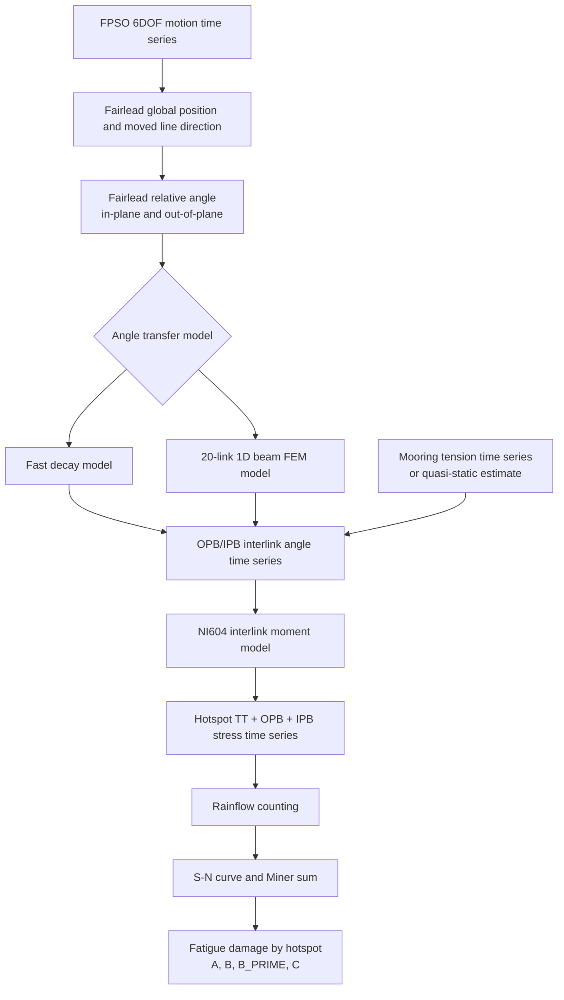

# FPSO Mooring OPB Fatigue Workflow

FPSO motion time series and mooring tension are converted to top-chain OPB/IPB interlink angles, then used to calculate BV NI604-style combined fatigue damage for mooring chain hotspots.

This repository is intended for engineering screening and workflow development. For class/design submission, replace the simplified fairlead-to-interlink transfer model with project-specific chain stopper tests, beam/FEM post-processing, or 3D contact analysis.

## Overall Flow



## Main Files

| File | Role |
| --- | --- |
| `fps_motion_to_ni604_input.py` | Converts FPSO motion to NI604 fatigue input columns. |
| `top_chain_beam_fem.py` | Solves the optional 20-link 1D beam/rotational-spring interlink angle model. |
| `ni604_opb_fatigue.py` | Calculates interlink moment, hotspot stress, rainflow cycles, and fatigue damage. |
| `fps_motion_demo.csv` | Synthetic FPSO motion and tension demo input. |
| `ni604_input_demo.csv` | Demo NI604 input using the fast decay angle model. |
| `ni604_input_demo_fem.csv` | Demo NI604 input using the 20-link FEM angle model. |

## Input Data

### 1. FPSO Motion Input

Used by `fps_motion_to_ni604_input.py`.

Required columns are flexible. Missing motion columns are treated as zero.

| Column | Unit | Required | Description |
| --- | --- | --- | --- |
| `time_s` | s | Optional | Time stamp. Used later for exposure scaling. |
| `surge_m` | m | Optional | FPSO surge motion. |
| `sway_m` | m | Optional | FPSO sway motion. |
| `heave_m` | m | Optional | FPSO heave motion. |
| `roll_deg` | deg | Optional | FPSO roll angle. |
| `pitch_deg` | deg | Optional | FPSO pitch angle. |
| `yaw_deg` | deg | Optional | FPSO yaw angle. |
| `tension_kN` | kN | Optional | Mooring tension. If absent, a simple quasi-static estimate can be used. |

Geometry input is provided through command-line options.

| Option | Unit | Description |
| --- | --- | --- |
| `--oc5-line 1|2|3` | - | Uses the OC5-DeepCwind mooring preset. |
| `--fairlead X Y Z` | m | Fairlead location in FPSO body axes. |
| `--anchor X Y Z` | m | Anchor location in global axes. |
| `--top-link-index` | - | Interlink selected for the default OPB/IPB output columns. |
| `--angle-model decay|fem` | - | Selects the fast decay model or the 20-link beam FEM model. |
| `--write-all-interlinks` | - | Writes OPB/IPB angles for all interlinks when using FEM. |

If `tension_kN` is absent, use:

| Option | Unit | Description |
| --- | --- | --- |
| `--pretension-kN` | kN | Initial line tension. |
| `--line-stiffness-kN-per-m` | kN/m | Linearized axial stiffness for tension estimate. |
| `--minimum-tension-kN` | kN | Lower bound for estimated tension. |

### 2. NI604 Fatigue Input

Used by `ni604_opb_fatigue.py`.

| Column | Unit | Required | Description |
| --- | --- | --- | --- |
| `tension_kN` | kN | Yes | Mooring tension time series. |
| `time_s` | s | Optional | Time stamp for exposure scaling. |
| `opb_interlink_angle_deg` | deg | Optional | OPB interlink angle. Converted to OPB moment internally. |
| `ipb_interlink_angle_deg` | deg | Optional | IPB interlink angle. Converted to IPB moment internally. |
| `opb_moment_Nmm` | N.mm | Optional | Direct OPB moment input. Overrides OPB angle input. |
| `ipb_moment_Nmm` | N.mm | Optional | Direct IPB moment input. Overrides IPB angle input. |

Chain and fatigue options:

| Option | Unit | Description |
| --- | --- | --- |
| `--diameter-mm` | mm | Nominal chain bar diameter. |
| `--mbl-kN` | kN | Minimum breaking load for NI604 hotspot C factor. |
| `--pretension-kN` | kN | Pretension for NI604 hotspot C factor. |
| `--gamma-tt` | - | Direct override for hotspot C factor, useful when MBL is unavailable. |
| `--oc5-line 1|2|3` | - | Uses OC5 chain diameter and pretension screening values. |
| `--exposure-years` | year | Scales damage from simulated duration to exposure duration. |
| `--occurrence-probability` | - | Sea-state occurrence weighting factor. |
| `--log10-k` | - | S-N curve intercept. Default is `12.436`. |
| `--sn-m` | - | S-N curve slope. Default is `3.0`. |

## Output Data

### Output from `fps_motion_to_ni604_input.py`

This output can be used directly as input to `ni604_opb_fatigue.py`.

| Column | Unit | Description |
| --- | --- | --- |
| `time_s` | s | Copied from input if present. |
| `tension_kN` | kN | Copied from input or estimated from line stretch. |
| `opb_interlink_angle_deg` | deg | Selected interlink OPB angle. |
| `ipb_interlink_angle_deg` | deg | Selected interlink IPB angle. |
| `opb_interlink_01_deg` ... `opb_interlink_19_deg` | deg | Optional FEM OPB angle distribution. |
| `ipb_interlink_01_deg` ... `ipb_interlink_19_deg` | deg | Optional FEM IPB angle distribution. |
| `fairlead_x_m`, `fairlead_y_m`, `fairlead_z_m` | m | Moved fairlead position in global coordinates. |
| `line_length_m` | m | Instantaneous fairlead-to-anchor distance. |
| `fairlead_angle_in_plane_deg` | deg | Relative fairlead angle in the nominal line vertical plane. |
| `fairlead_angle_out_of_plane_deg` | deg | Relative fairlead angle normal to the nominal line vertical plane. |

### Output from `ni604_opb_fatigue.py`

The script prints JSON to the terminal.

| JSON Field | Description |
| --- | --- |
| `input.samples` | Number of time samples. |
| `input.duration_seconds` | Simulated duration. |
| `input.exposure_scale` | Damage scaling factor from duration and occurrence probability. |
| `input.opb_source`, `input.ipb_source` | Indicates whether angle, moment, or zero bending was used. |
| `hotspots.A/B/B_PRIME/C.governing.damage` | Governing Miner damage for each hotspot. |
| `hotspots.*.governing.stress_range_max_MPa` | Maximum counted stress range. |
| `hotspots.*.all_sign_combinations` | Damage for all OPB/IPB sign combinations. |

## Example Commands

Create synthetic OC5 demo data with the fast decay angle model:

```powershell
python fps_motion_to_ni604_input.py --make-demo --oc5-line 1
```

Create synthetic OC5 demo data with the 20-link FEM model:

```powershell
python fps_motion_to_ni604_input.py --make-demo `
  --oc5-line 1 `
  --angle-model fem `
  --write-all-interlinks `
  --demo-duration-s 300
```

Run fatigue damage calculation:

```powershell
python ni604_opb_fatigue.py ni604_input_demo_fem.csv `
  --oc5-line 1 `
  --time-column time_s `
  --exposure-years 1
```

Run with project-specific geometry:

```powershell
python fps_motion_to_ni604_input.py motion.csv ni604_input.csv `
  --fairlead 85 -28 -18 `
  --anchor 1450 -620 -1200 `
  --angle-model fem `
  --beam-bar-diameter-m 0.12 `
  --beam-link-length-m 0.72 `
  --beam-e-pa 2.1e11
```

Then:

```powershell
python ni604_opb_fatigue.py ni604_input.csv `
  --diameter-mm 120 `
  --mbl-kN 12000 `
  --pretension-kN 1800 `
  --time-column time_s `
  --exposure-years 20
```

## Validation

Public literature usually provides equations, coefficients, figures, and damage tables, but not the full raw tension/angle time series. Because of that, the current validation package checks constants and published trends rather than claiming exact one-to-one reproduction.

Validation files:

| File | Role |
| --- | --- |
| `validation/literature_benchmarks.md` | Public references, validation scope, and limitations. |
| `validation/mdpi_2024_table8_damage_life.csv` | Published total damage and life from MDPI 2024 Table 8. |
| `validation/mdpi_2024_appendix_a4_subset.csv` | Published case-by-case damage subset from MDPI 2024 Appendix Table A4. |
| `validation/check_mdpi_trends.py` | Automated checks for code constants and literature damage trends. |

Run:

```powershell
python validation/check_mdpi_trends.py
```

The check confirms that the code uses the expected studless-chain hotspot SCFs, the default free-corrosion S-N curve, the Table 8 damage/life ordering, and the governing-hotspot pattern in the transcribed Appendix A4 subset.

## Modeling Notes

- OPB fatigue cannot be calculated from tension alone. Interlink angle or interlink moment is required.
- The decay model is fast and useful for early checks, but its angle distribution is prescribed.
- The FEM model is more physical because it distributes fairlead angle through 20 beam links and nonlinear interlink springs.
- OC5 values are useful for a FOWT workflow example, but OC5 uses a scaled brass-chain test model. Treat OC5 results as screening values.
- The NI604 moment model implementation is intended for workflow development. Confirm coefficients, applicability range, S-N curve, and safety factors against the governing project/class document before design use.
